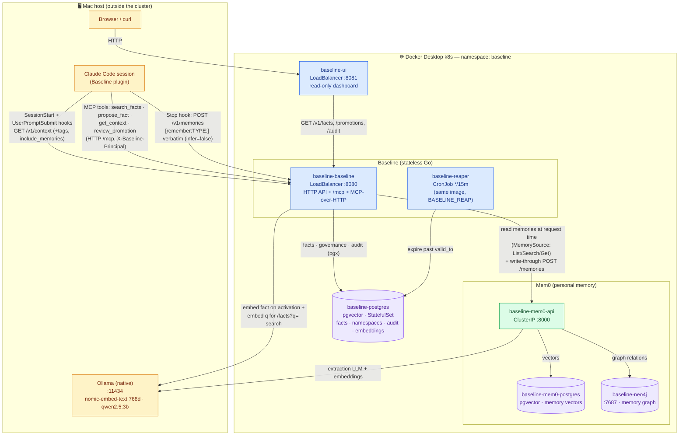
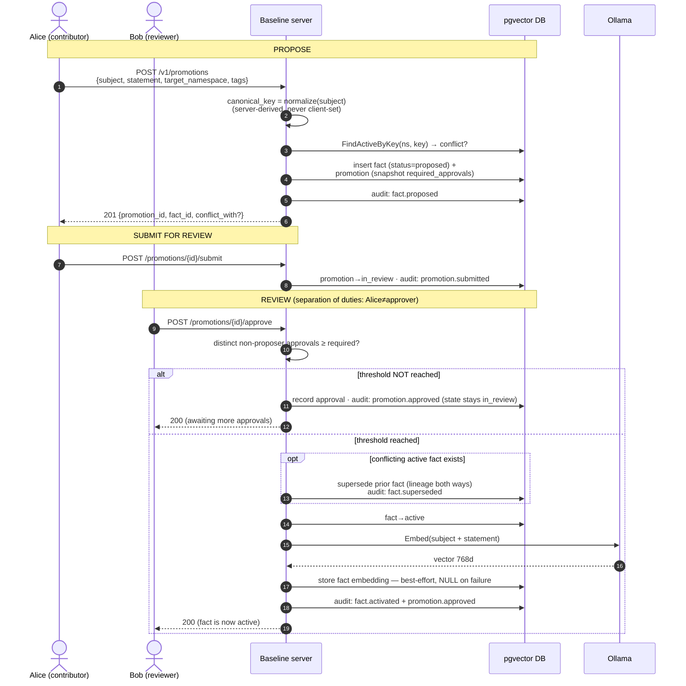
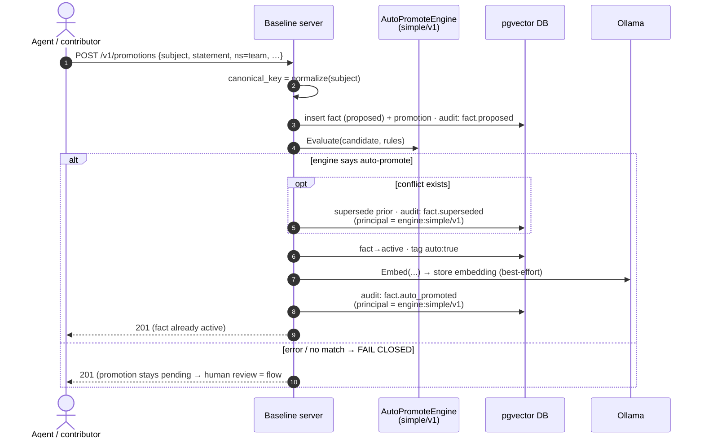
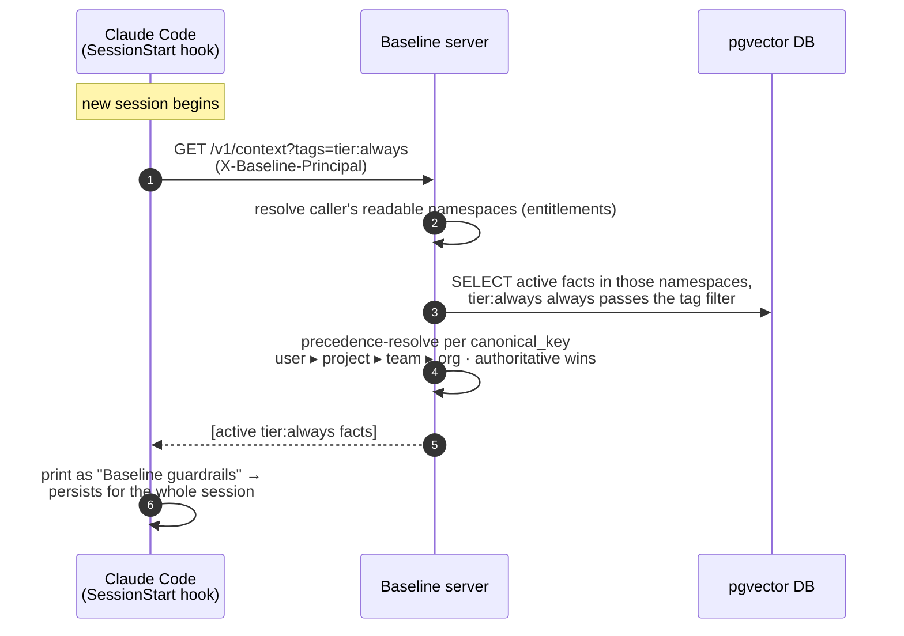
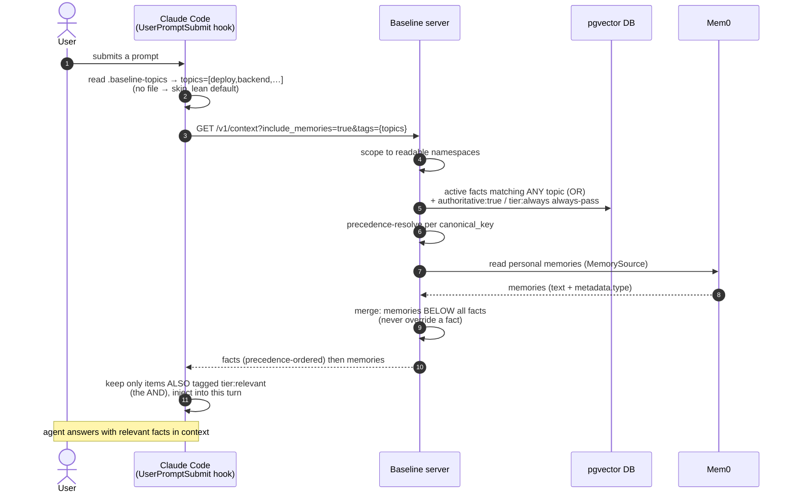

# Baseline — Local Architecture (Docker Desktop k8s + host Ollama)

The system as it actually runs **locally** (`make local-up`): a Docker Desktop
Kubernetes cluster in the `baseline` namespace, with **Ollama running natively on
the Mac** (reached via `host.docker.internal:11434`). Verified against the live
deployment, not idealized.

> Scope: this is the _local_ topology. The Pi deployment differs (Mem0 on OpenAI,
> no Baseline embedder → substring search). See `deploy/pi/values.yaml`.

## The one-paragraph story

A **Claude Code** session (the agent) talks to **Baseline** three ways: hooks
inject governed facts into the prompt, the MCP tools let the agent search/propose
facts, and a Stop hook captures `[remember:]` memories. Baseline is a **stateless
Go service** whose source of truth is its **own pgvector Postgres** (facts +
governance + audit). It _reads_ personal memories at request time from **Mem0**
(which has its own Postgres + Neo4j), and merges them below facts in `/context`.
Both Baseline and Mem0 use the **same host Ollama** for embeddings (and Mem0 also
for its extraction LLM). A **dashboard** reads Baseline over HTTP. A **reaper**
CronJob expires stale facts.

## Component / data-flow diagram

## What talks to what (verified edges)

| From                    | To                       | Protocol / path                                          | Purpose                                                                                            |
| ----------------------- | ------------------------ | -------------------------------------------------------- | -------------------------------------------------------------------------------------------------- |
| Claude Code (hooks)     | baseline `:8080`         | `GET /v1/context`                                        | inject tier'd facts (+ memories) into the prompt                                                   |
| Claude Code (MCP)       | baseline `:8080/mcp`     | MCP-over-HTTP, `X-Baseline-Principal`                    | `search_facts` (semantic), `propose_fact`, `get_context`, `review_promotion`, `list_my_promotions` |
| Claude Code (Stop hook) | baseline `:8080`         | `POST /v1/memories`                                      | capture `[remember:TYPE:]` verbatim (`infer=false`)                                                |
| Dashboard               | baseline `:8080`         | `GET /v1/facts · /promotions · /audit`                   | read-only governance views                                                                         |
| Baseline                | **its own** pgvector     | pgx/v5                                                   | facts, namespaces, audit, **fact embeddings** (source of truth)                                    |
| Baseline                | **host Ollama** `:11434` | `POST /api/embeddings`                                   | embed facts on activation; embed `q` for semantic search                                           |
| Baseline                | Mem0 `:8000`             | `MemorySource` (read) + `POST /memories` (write-through) | read personal memories at request time; capture pass-through                                       |
| Mem0                    | mem0-postgres (pgvector) | —                                                        | memory vectors                                                                                     |
| Mem0                    | Neo4j `:7687`            | bolt                                                     | memory graph relations                                                                             |
| Mem0                    | **host Ollama** `:11434` | —                                                        | extraction LLM (`qwen2.5:3b`) + embeddings (`nomic-embed-text`)                                    |
| Reaper CronJob          | baseline pgvector        | pgx                                                      | expire facts past `valid_to` (every 15m)                                                           |

## Load-bearing facts the picture encodes

- **Two separate pgvector databases.** Baseline owns facts in
  `baseline-postgres`; Mem0 owns memories in `baseline-mem0-postgres`. Baseline
  **never writes vectors to Mem0** — only neutral text/metadata crosses the
  boundary. Baseline owns its fact embeddings.
- **Baseline is the only governance authority.** Facts, promotions (propose →
  review → approve, separation-of-duties), and the append-only audit all live in
  Baseline's DB. Mem0 answers "what did this agent see?"; Baseline answers "what
  does the org officially know?"
- **`/context` is the merge point.** It returns precedence-resolved active facts
  in the caller's entitled namespaces, then merges personal memories _below_ all
  facts (memories never override a fact).
- **Ollama is shared but used for two different jobs.** Baseline uses it only for
  **embeddings** (semantic search + fact embedding). Mem0 uses it for both
  embeddings _and_ its extraction/dedup **LLM**.
- **Stateless service, two run-modes from one image.** The same `baseline:dev`
  image serves HTTP, runs the reaper (`BASELINE_REAP`), and can backfill
  embeddings (`BASELINE_EMBED_BACKFILL`) — mode chosen by env var.
- **Identity is a dev header today.** `X-Baseline-Principal` (HeaderAuthenticator)
  — real OIDC/mTLS is the deferred production seam.

---

## Sequence diagrams

Four temporal flows that the static picture above can't show: how a fact is
**proposed → reviewed → activated** (human path), how it's **auto-promoted**
(engine path), and how active facts get **injected into an agent's context**
(both the once-per-session and per-turn paths). Verified against the code in
`internal/promotions/service.go`, `internal/facts/`, and the plugin hooks.

### 1. Propose → review → approve (the human governance path)

A contributor proposes a fact; the server derives its canonical identity and
detects conflicts; distinct reviewers approve; on the threshold approval the fact
goes **active** (superseding any prior fact for the same key) — every transition
writing exactly one audit event.

**Key invariants in this flow:** `canonical_key` is derived server-side from the
structured `subject` (step 2), never parsed from prose; the proposer can **never**
be a counted approver (separation of duties); supersede-then-activate ordering
honors the one-active-fact-per-key unique index; embedding is **best-effort** and
never blocks activation.

### 2. Propose → auto-promote (the engine path)

When the target namespace pins an `AutoPromoteEngine` (e.g. `team` →
`simple/v1`) and the candidate matches the rules, activation happens **inside the
propose transaction** — no human review. It **fails closed**: any engine error,
unknown engine, or non-match falls through to the human path above.

**Why fail-closed matters:** uncertainty never auto-approves. The audit
attributes the action to `engine:simple/v1` (not a human), and the fact carries
`auto:true` — so an auto-promoted fact is always distinguishable and traceable.

### 3a. Inject ALWAYS-ON facts (once per session)

At session start the plugin pulls the mandatory guardrails — `tier:always` facts
— and prints them into the agent's context. They persist the whole session, paid
for once.

### 3b. Inject RELEVANT facts (per turn)

On every user prompt, the plugin injects only facts that are **both**
`tier:relevant` **and** tagged with a topic this repo declares in
`.baseline-topics` — plus the caller's personal memories (ranked below facts).
Because Baseline's tag filter is OR-overlap, the hook queries by topic then
**client-side-filters** to the AND with `tier:relevant`.

**The two-tier design in one line:** `tier:always` is the _push-once_ baseline
(SessionStart); `tier:relevant` + `.baseline-topics` is the _push-per-turn-when-
on-topic_ set (UserPromptSubmit); everything else is `tier:ondemand` — the agent
pulls it via the `search_facts` / `get_context` MCP tools only when it needs it.
