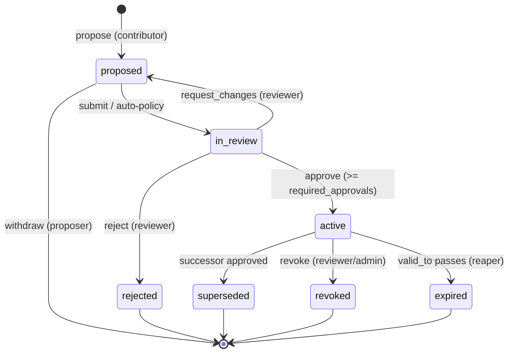

# Baseline — Facts Management Service Specification

**Name:** Baseline — after the Post-Traumatic Baseline Test in _Blade Runner 2049_, which checks whether a subject has deviated from an approved baseline. This service is the apparatus, not the subject: it holds the organization's baseline of truth and decides what conforms. (Earlier working name: K, after Officer KD6-3.7.)
**Status:** Draft v0.2 — buildable spec, all v1 decisions locked
**Owner:** John
**Companion artifact:** `agent-memory` Helm chart (Mem0 + Postgres/pgvector + Ollama)

---

## 1. Purpose

Baseline is the governance layer that sits in front of the agent memory store. It lets
raw, personal **memories** be _promoted_ into curated **facts** that live in **shared
namespaces** (team / project / org). A **governance team** controls that promotion:
nothing becomes a trusted, org-wide fact without review.

The memory store (Mem0) answers "what has this agent/person seen?" Baseline answers
"what does the organization officially know, who vouched for it, and is it still true?"

### Goals

- Promote a memory → fact through a reviewed, auditable workflow.
- Scope every fact to exactly one owning namespace; serve reads as a _scoped union_.
- Give a governance team an inbox to approve / reject / edit / request-changes.
- Track provenance, validity windows, supersession, and conflicts for every fact.
- Expose a single **context endpoint** agents call to get the facts they're entitled to.
- Be fully auditable (append-only) and self-hostable alongside the existing chart.

### Non-goals (v1)

- Replacing Mem0 (Baseline _uses_ it; memories stay there).
- Full free-text wiki / document management — facts are atomic statements, not pages.
- Cross-org federation. Single tenant (one organization), multiple namespaces.

---

## 2. Concepts & terminology

| Term                | Definition                                                                                                                                                         |
| ------------------- | ------------------------------------------------------------------------------------------------------------------------------------------------------------------ |
| **Memory**          | Raw, learned statement scoped to one actor. Lives in Mem0, keyed by `user_id`/`agent_id`. Cheap, ungated, possibly noisy.                                          |
| **Fact**            | A curated statement promoted into a shared namespace and approved by governance. Carries provenance, validity, lineage, status. Source of truth lives in Baseline. |
| **Namespace**       | A scope that owns facts: `user:*` (private), `team:*`, `project:*`, `org`. Shared namespaces are team/project/org.                                                 |
| **Promotion**       | The workflow object that drives a candidate memory (or hand-authored statement) toward becoming an active fact in a namespace.                                     |
| **Governance team** | The set of reviewers/admins authorized to approve promotions into a given shared namespace.                                                                        |
| **Subject**         | A fact's structured identity — `{type, scope?, qualifiers?}` — supplied at propose time, not parsed from the statement.                                            |
| **Canonical key**   | A normalized identity **derived** from `subject` (e.g. `build.command:service-foo`), used to detect duplicates/conflicts and drive supersession.                   |
| **Context**         | The resolved, ordered set of facts (optionally merged with personal memories) returned to an agent for prompt injection.                                           |

---

## 3. System context

```
        ┌────────────┐   propose / review / read-context
agents ─┤ MCP bridge ├──────────────┐
(CC,IDE)└────────────┘              │
                                    ▼
   governance team ──(console)──► ┌──────────────────────────┐
                                  │         Baseline         │
                                  │  facts · promotions ·    │
                                  │  namespaces · rbac ·     │
                                  │  context · audit         │
                                  └───────┬───────────┬──────┘
                  reads candidate memories │           │ stores facts + governance state
                                           ▼           ▼
                                   ┌───────────┐   ┌──────────────────────┐
                                   │  Mem0 API │   │ Postgres + pgvector  │
                                   │ (memories)│   │ (baseline DB: facts, │
                                   └───────────┘   │ promotions, audit…)  │
                                                   └──────────────────────┘
```

Baseline is a stateless Go service. Source of truth for **facts and governance state**
is its own Postgres database (reusing the chart's Postgres instance, separate DB).
**Memories** remain in Mem0; Baseline reads them as promotion candidates and merges them
at read-time in the context endpoint.

---

## 4. Data model

### 4.1 Fact

| Field                       | Type         | Notes                                                                                                    |
| --------------------------- | ------------ | -------------------------------------------------------------------------------------------------------- |
| `id`                        | uuid         | PK                                                                                                       |
| `namespace_id`              | uuid (FK)    | Owning shared namespace                                                                                  |
| `statement`                 | text         | The fact, verbatim/curated (human-readable rendering)                                                    |
| `subject`                   | jsonb        | Structured identity: `{type, scope?, qualifiers?}` (see §4.6)                                            |
| `canonical_key`             | text         | **Derived** from `subject` by `normalize()`; unique-active per namespace. Never parsed from `statement`. |
| `status`                    | enum         | `proposed`,`in_review`,`active`,`superseded`,`revoked`,`expired`,`rejected`                              |
| `confidence`                | numeric(3,2) | 0–1, reviewer-set or inherited                                                                           |
| `source_memory_ids`         | text[]       | Mem0 memory IDs this was derived from                                                                    |
| `provenance`                | jsonb        | `{origin_actor, origin_session, derived_from[], rationale}`                                              |
| `valid_from`                | timestamptz  | Default = approval time                                                                                  |
| `valid_to`                  | timestamptz  | Null = no expiry; reaper expires when passed                                                             |
| `supersedes_id`             | uuid         | Lineage: the fact this replaces                                                                          |
| `superseded_by_id`          | uuid         | Set when a successor is approved                                                                         |
| `tags`                      | text[]       | Free labels for filtering                                                                                |
| `metadata`                  | jsonb        | Arbitrary structured attrs (queryable)                                                                   |
| `embedding`                 | vector(N)    | pgvector; N must match embedder dims (see §11)                                                           |
| `created_by`                | text         | Principal who proposed                                                                                   |
| `approved_by`               | text[]       | Principals who approved                                                                                  |
| `version`                   | int          | Optimistic concurrency / ETag                                                                            |
| `created_at` / `updated_at` | timestamptz  |                                                                                                          |

**Invariant:** at most one `active` fact per (`namespace_id`, `canonical_key`).

### 4.2 PromotionRequest

| Field                       | Type        | Notes                                                                                |
| --------------------------- | ----------- | ------------------------------------------------------------------------------------ |
| `id`                        | uuid        | PK                                                                                   |
| `fact_id`                   | uuid (FK)   | The fact being moved through review                                                  |
| `target_namespace_id`       | uuid (FK)   | Where it's being promoted to                                                         |
| `proposed_statement`        | text        | Editable during review                                                               |
| `state`                     | enum        | `pending`,`in_review`,`changes_requested`,`approved`,`rejected`                      |
| `candidate_memory_ids`      | text[]      | Source memories                                                                      |
| `proposer`                  | text        | Principal                                                                            |
| `reviews`                   | jsonb[]     | `[{reviewer, decision, comment, at}]`                                                |
| `required_approvals`        | int         | Snapshot of namespace policy at creation                                             |
| `auto_promote_decision`     | jsonb       | `{engine, decision, reason, matched_rule}` if an engine evaluated it; null otherwise |
| `conflict_with`             | uuid        | Existing active fact with same canonical_key, if any                                 |
| `idempotency_key`           | text        | Dedupe POSTs                                                                         |
| `created_at` / `updated_at` | timestamptz |                                                                                      |

**Separation of duties:** `proposer` MUST NOT appear in `reviews[].reviewer` as an approver.

### 4.3 Namespace

| Field        | Type        | Notes                                                                               |
| ------------ | ----------- | ----------------------------------------------------------------------------------- |
| `id`         | uuid        | PK                                                                                  |
| `name`       | text        | e.g. `team:platform-eng`, `org`                                                     |
| `kind`       | enum        | `user`,`team`,`project`,`org`                                                       |
| `parent_id`  | uuid        | For precedence/inheritance                                                          |
| `policy`     | jsonb       | `{required_approvals, allow_auto_promote, auto_promote_rules[], allowed_proposers}` |
| `created_at` | timestamptz |                                                                                     |

### 4.4 Membership (RBAC binding)

| Field          | Type        | Notes                                               |
| -------------- | ----------- | --------------------------------------------------- |
| `id`           | uuid        | PK                                                  |
| `principal`    | text        | User or agent identity                              |
| `namespace_id` | uuid (FK)   | Scope of the grant                                  |
| `role`         | enum        | `reader`,`contributor`,`reviewer`,`namespace_admin` |
| `created_at`   | timestamptz |                                                     |

A `platform_admin` role is global (not namespace-scoped) and manages the namespace registry.

### 4.5 AuditEvent (append-only)

| Field                     | Type        | Notes                                                    |
| ------------------------- | ----------- | -------------------------------------------------------- |
| `id`                      | uuid        | PK                                                       |
| `at`                      | timestamptz |                                                          |
| `principal`               | text        | Who acted                                                |
| `action`                  | text        | e.g. `fact.proposed`,`promotion.approved`,`fact.revoked` |
| `subject_type`            | text        | `fact`/`promotion`/`namespace`/`membership`              |
| `subject_id`              | uuid        |                                                          |
| `from_state` / `to_state` | text        | For transitions                                          |
| `detail`                  | jsonb       | Diff / comment / policy snapshot                         |

**Invariant:** every fact/promotion state transition writes exactly one AuditEvent. Audit rows are never updated or deleted.

### 4.6 Subject & canonical key derivation

A fact's **identity** is its `subject`, supplied as structured data at propose time — it is
never parsed from the free-text `statement`. This makes conflict detection and supersession
(§10) deterministic rather than dependent on phrasing or NLP.

```json
"subject": {
  "type": "build.command",          // required: dotted category, lower-case
  "scope": "service-foo",           // optional: what it applies to; default "global"
  "qualifiers": { "env": "prod" }   // optional: extra identity dimensions
}
```

`canonical_key = normalize(subject)` is a pure, deterministic function:

1. lower-case and trim `type` and `scope`;
2. append `qualifiers` as `k=v` pairs sorted by key;
3. join with `:` → e.g. `build.command:service-foo` or `build.command:service-foo:env=prod`.

Properties (asserted by conformance, §14):

- **Deterministic** — identical `subject` ⇒ identical key, in any process, every time.
- **Phrasing-independent** — differently worded statements about the same subject collapse to
  one key, so a re-worded update _supersedes_ rather than duplicates.
- **Derived, never client-set** — `canonical_key` is always recomputed from `subject` on write
  through the single `normalize()` path; a client cannot set it directly.

**LLM assist (optional, suggestion-only):** at propose time a model may _suggest_ a `subject`
for a free-text candidate ("looks like a `build.command` for `service-foo` — confirm?"), but
the stored `subject` is whatever the proposer/agent commits, and the key derives from that
field — never from the model's interpretation. Identity stays deterministic; the LLM only
improves ergonomics.

If `type` + `scope` suffice for v1 (no qualifiers), `canonical_key` may be a Postgres
**generated column** for free DB-level consistency; with qualifiers, compute it in the single
`normalize()` path in `internal/facts`.

---

## 5. Fact lifecycle (state machine)



Transition authority (enforced by RBAC, §7):

| Transition           | Trigger            | Required role (in target namespace)                  |
| -------------------- | ------------------ | ---------------------------------------------------- |
| → proposed           | propose            | `contributor`+                                       |
| proposed → in_review | submit / auto-rule | proposer or system                                   |
| in_review → active   | approve            | `reviewer`, ≥ `required_approvals`, not the proposer |
| in_review → rejected | reject             | `reviewer`                                           |
| in_review → proposed | request_changes    | `reviewer`                                           |
| active → revoked     | revoke             | `reviewer`/`namespace_admin`                         |
| active → superseded  | system             | automatic on successor approval                      |
| active → expired     | reaper job         | system                                               |

---

## 6. Namespaces & scoping

- Facts belong to exactly one **owning** namespace.
- A principal's **entitled set** = namespaces where they hold any role, transitively up
  the `parent_id` chain for reads (member of `team:platform-eng` ⇒ can read `org`).
- **Read precedence** (most specific wins for the same `canonical_key`):
  `user` ▸ `project` ▸ `team` ▸ `org` — _except_ facts tagged `authoritative:true`
  (org conventions, security baselines) which always win. This is a policy default;
  make it configurable per namespace.
- Personal memories (Mem0) are always lowest precedence and never override an active fact.

---

## 7. RBAC & governance

### 7.1 Roles (namespace-scoped unless noted)

| Role                        | Can                                                         |
| --------------------------- | ----------------------------------------------------------- |
| `reader`                    | Read active facts in the namespace                          |
| `contributor`               | + propose promotions into the namespace                     |
| `reviewer`                  | + approve / reject / request-changes; revoke active facts   |
| `namespace_admin`           | + manage memberships, edit policy, create child namespaces  |
| `platform_admin` _(global)_ | Manage the namespace registry; emergency override (audited) |

### 7.2 Permission matrix

| Action                  | reader | contributor | reviewer | ns_admin |
| ----------------------- | :----: | :---------: | :------: | :------: |
| read facts              |   ✔    |      ✔      |    ✔     |    ✔     |
| propose promotion       |        |      ✔      |    ✔     |    ✔     |
| approve / reject        |        |             |    ✔     |    ✔     |
| revoke active fact      |        |             |    ✔     |    ✔     |
| manage members / policy |        |             |          |    ✔     |

### 7.3 Approval policy (per namespace)

```json
{
  "required_approvals": 2,
  "allowed_proposers": ["role:contributor"],
  "auto_promote": {
    "engine": "simple/v1",
    "rules": { "...": "schema is specific to the named engine+version" }
  }
}
```

`auto_promote` is **optional**. If omitted (or `engine` null), the namespace has no
auto-promotion — every promotion goes to human review. If present, the named engine
evaluates each candidate and may transition it straight to `active` (see §7.4).

Defaults: `org` → `required_approvals: 2`, **no** `auto_promote`. `team` → `1`,
`auto_promote.engine: "simple/v1"`. `project` → `1`. Separation of duties is always
enforced regardless of policy.

### 7.4 Auto-promotion engines (named + versioned)

Auto-promotion logic is a **pluggable, versioned engine** selected per namespace by an
`engine` ID of the form `family/vN`. This mirrors the memory-source port (§11): Baseline depends
on the engine interface, not on a specific rule language.

```go
type AutoPromoteEngine interface {
    ID() string                                    // e.g. "simple/v1"
    Validate(rules json.RawMessage) error          // checked at policy-write time
    Evaluate(ctx context.Context, c Candidate, rules json.RawMessage) (Decision, error)
}
// Decision: { AutoPromote bool; Reason string }  — never returns an approver identity.
```

A registry maps `ID()` → engine. Namespace policy references the ID; an unregistered or
unknown ID makes the policy **invalid** (rejected at write time — fail closed).

**Versioning semantics (the point of this design):**

- Each `family/vN` is an independent, immutable implementation. `simple/v2` may change rule
  schema and semantics in breaking ways; that's allowed _because_ it's a new version.
- Registering `simple/v2` does **not** affect namespaces pinned to `simple/v1` — they keep
  evaluating under v1 until an admin explicitly changes the policy. No silent migration.
- A `Validate` failure under the pinned engine blocks the policy write, so a namespace can
  never hold rules its engine can't interpret.
- New engine _families_ (e.g. `cel/v1`, `cedar/v1`) are added later by registering more
  implementations — zero changes to Baseline's core.

**`simple/v1` — the starter engine (deliberately tiny):**

- `rules` is a flat list of rule objects. A candidate auto-promotes if it matches **any**
  rule (OR); within a rule, **all** conditions must hold (AND).
- Each condition is `{ "field": <whitelisted>, "op": "eq"|"in", "value": <scalar|array> }`.
- Whitelisted fields only (no arbitrary expression language, no code): `provenance.origin_type`,
  `provenance.source.kind`, `actor.type`, `tags`, and `metadata.<key>`.
- Anything outside the whitelist, any unknown `op`, or malformed rules → `Validate` rejects.

Example `simple/v1` rules — auto-promote facts derived from a merged PR authored by a team member:

```json
{
  "rules": [
    {
      "all": [
        { "field": "provenance.origin_type", "op": "eq", "value": "merged_pr" },
        { "field": "actor.type", "op": "in", "value": ["human", "team-agent"] }
      ]
    }
  ]
}
```

**Engine safety invariants (hold for every engine, every version):**

- **Fail closed.** Any engine error, timeout, or invalid rules ⇒ no auto-promotion; the
  candidate falls back to normal human review. An engine never auto-approves on uncertainty.
- **Attribution.** An auto-promotion writes an AuditEvent with `principal = "engine:<ID>"`
  (e.g. `engine:simple/v1`) and the matched rule in `detail`, so it's traceable and revocable
  like any other transition. Auto-promoted facts are tagged `auto:true`.
- **Determinism.** Same candidate + same rules + same engine version ⇒ same decision
  (required for audit replay).
- **Ceiling.** An engine can only auto-promote within the namespace it's configured on; it
  cannot promote into a parent/higher namespace.

---

## 8. Promotion workflow

1. **Discover** — a contributor (or an agent acting as one) lists/searches candidate
   memories from the memory source (Mem0 by default) for an actor, picks one or more.
2. **Propose** — `POST /promotions` with `target_namespace`, `proposed_statement`
   (defaults to the memory's text, editable), a structured `subject` (§4.6), and
   `candidate_memory_ids`. Baseline derives `canonical_key` from `subject`, runs **conflict
   detection** against active facts in the
   target namespace, snapshots the policy into `required_approvals`, creates a Fact in
   `proposed` and a PromotionRequest in `pending`. If the namespace configures
   `auto_promote`, the pinned engine (§7.4) evaluates the candidate; a positive decision
   transitions the Fact straight to `active` (attributed to `engine:<ID>`), and any engine
   error or non-match falls through to human review.
3. **Review** — the governance team sees the request in their **inbox**
   (`GET /promotions?namespace=…&state=in_review`), including the candidate memory,
   proposed statement, any conflicting fact, and provenance. They `approve`,
   `reject`, `request_changes`, or edit the statement.
4. **Approve** — when **distinct** reviewers ≥ `required_approvals` have approved (proposer
   excluded; order doesn't matter — any-N model), the Fact becomes `active`, stamped with
   `valid_from`, `approved_by`, and (if it had a conflict) the prior fact is `superseded`
   with lineage set.
5. **Serve** — the fact is now returned by `GET /context` to entitled agents.

Every step writes an AuditEvent.

---

## 9. API surface (REST)

Base: `/v1`. AuthN via bearer (OIDC) or mTLS; principal resolved server-side. All list
endpoints are namespace-scoped to the caller's entitlements.

### Facts

- `GET /facts` — query: `namespace`, `status`, `canonical_key`, `tag`, `q` (semantic), `limit`
- `GET /facts/{id}`
- `GET /facts/{id}/history` — lineage + audit trail
- `PATCH /facts/{id}` — revoke / edit metadata (reviewer); optimistic via `If-Match: <version>`
- `POST /facts/{id}:supersede` — propose a replacement (shortcut to a promotion)

### Promotions

- `POST /promotions` — propose (idempotent via `Idempotency-Key`)
- `GET /promotions` — inbox; filters `namespace`, `state`, `proposer`
- `GET /promotions/{id}`
- `POST /promotions/{id}:approve` — body `{comment}`
- `POST /promotions/{id}:reject` — body `{comment}`
- `POST /promotions/{id}:request-changes` — body `{comment, suggested_statement?}`
- `POST /promotions/{id}:withdraw` — proposer only

### Namespaces & memberships

- `GET /namespaces` · `POST /namespaces` (platform_admin)
- `GET /namespaces/{id}` · `PATCH /namespaces/{id}` (policy; ns_admin)
- `GET /namespaces/{id}/members` · `POST /namespaces/{id}/members` · `DELETE …/{principal}`

### Context (agent read path)

- `GET /context` — query: `actor_id`, `namespaces` (optional override within entitlements),
  `q` (semantic), `include_memories` (bool), `limit`
  Returns ordered, precedence-resolved facts + optional merged personal memories.
  This is the endpoint agents call before each turn.

### Audit

- `GET /audit` — query: `subject_type`, `subject_id`, `principal`, `since`, `until`

### MCP tools (thin bridge over the above)

| Tool                 | Maps to                        |
| -------------------- | ------------------------------ |
| `get_context`        | `GET /context`                 |
| `search_facts`       | `GET /facts?q=`                |
| `propose_fact`       | `POST /promotions`             |
| `list_my_promotions` | `GET /promotions?proposer=me`  |
| `review_promotion`   | approve/reject/request-changes |

---

## 10. Retrieval & conflict resolution

**Context resolution algorithm** (`GET /context`):

1. Compute caller's entitled namespaces (intersect with `namespaces` override).
2. Semantic + filter query `active` facts across those namespaces (pgvector + metadata).
3. Drop `expired`/`revoked`/`superseded`. Drop facts whose `valid_to` < now.
4. For each `canonical_key`, keep the **highest-precedence** fact (§6); `authoritative`
   beats specificity.
5. If `include_memories`, query the memory source (via the `MemorySource` port) for the
   actor's personal memories, append below all
   facts (lowest precedence), de-duplicated against facts by canonical_key.
6. Return ordered list with `source` (`fact`/`memory`), `namespace`, `confidence`,
   `valid_to`, and provenance refs.

**Conflict detection** (at propose time): if an `active` fact exists with the same
`canonical_key` in the target namespace, attach `conflict_with` to the promotion and
surface it to reviewers. Approval of the new fact supersedes the old one atomically.

---

## 11. Memory source integration (port + adapters)

Baseline is **loosely coupled** to its memory backend. The entire dependency is three
**read-only** calls in two roles — listing candidate memories to promote, and fetching
one by ID for provenance. Baseline never writes to the memory backend. Everything that defines Baseline
(facts, state machine, governance, audit, fact embeddings, `/context`) is Baseline-owned and
never calls the backend.

To keep the backend swappable, Baseline depends on a narrow **port**, not on Mem0 directly:

```go
// MemorySource is the entire contract Baseline needs from a memory backend.
// Mem0 is one adapter; Zep, Letta, a raw Postgres table, or none are others.
type MemorySource interface {
    List(ctx context.Context, actorID string, opts ListOpts) ([]Memory, error)
    Search(ctx context.Context, actorID, query string, opts SearchOpts) ([]Memory, error)
    Get(ctx context.Context, id string) (Memory, error)
}

// Neutral type that crosses the boundary — no backend-specific shape leaks in.
type Memory struct {
    ID        string
    ActorID   string
    Content   string
    Metadata  map[string]any
    CreatedAt time.Time
}
```

Data crossing the boundary is neutral text + metadata, never embedding vectors — so Baseline and
the memory backend need not share an embedder, and there is no vector-space coupling.

### Adapters

| Adapter              | Implements `MemorySource` via                                                                                     |
| -------------------- | ----------------------------------------------------------------------------------------------------------------- |
| `mem0` _(default)_   | Mem0 REST: `GET /v1/memories?user_id=` (List), `POST /v1/memories/search` (Search), `GET /v1/memories/{id}` (Get) |
| `zep` / `letta`      | Future adapters; new package, **zero changes** to Baseline's core                                                 |
| `none` (null source) | Returns empty results; Baseline runs **standards-only** (see §11.2)                                               |

Selected at startup via `MEMORY_SOURCE=mem0|zep|letta|none`. The `mem0` adapter additionally
takes `MEM0_URL`. Pin the Mem0 REST paths above inside the adapter only — version drift is
contained to one package.

### 11.1 Embeddings (Baseline-owned — DECIDED, see §18.1)

Baseline maintains its **own** `embedding` column for fact search, fully decoupled from any memory
backend's vector store. Embed via the chart's model (default Ollama `nomic-embed-text`,
**768 dims**). The fact table's `vector(N)` MUST equal the embedder's dimension — mirror the
chart's dimension footgun guard. Config: `EMBEDDER_URL`, `EMBEDDER_MODEL`, `EMBEDDER_DIMS`.

### 11.2 Standards-only mode (`MEMORY_SOURCE=none`)

Standards are **authored**, not promoted from memories, so Baseline can run with no memory backend
at all: the null source returns empty candidate lists, promotion-from-memory is simply
unused, and `/context` serves only authored facts/standards. This is a first-class
deployment — e.g. injecting a HIPAA/SOC2 baseline into every agent with no Mem0 anywhere.
That the system runs fully with the dependency removed is the coupling guarantee.

**Rejected alternative:** materializing approved facts back into a shared Mem0 namespace so
Mem0-wired agents retrieve facts directly. Rejected — dual-write creates a consistency
burden and re-couples Baseline to the backend; merge-at-read `/context` keeps one source of truth.

---

## 12. Storage (Postgres + pgvector)

Reuse the chart's Postgres; separate database `baseline`. Sketch:

```sql
CREATE EXTENSION IF NOT EXISTS vector;

CREATE TABLE namespaces (
  id uuid PRIMARY KEY DEFAULT gen_random_uuid(),
  name text UNIQUE NOT NULL,
  kind text NOT NULL CHECK (kind IN ('user','team','project','org')),
  parent_id uuid REFERENCES namespaces(id),
  policy jsonb NOT NULL DEFAULT '{}'::jsonb,
  created_at timestamptz NOT NULL DEFAULT now()
);

CREATE TABLE facts (
  id uuid PRIMARY KEY DEFAULT gen_random_uuid(),
  namespace_id uuid NOT NULL REFERENCES namespaces(id),
  statement text NOT NULL,
  subject jsonb NOT NULL,                  -- {type, scope?, qualifiers?}
  canonical_key text NOT NULL,             -- = normalize(subject); see §4.6
  -- if v1 omits qualifiers, prefer a generated column instead of app-computed:
  --   canonical_key text GENERATED ALWAYS AS (
  --     lower(subject->>'type') || ':' || lower(coalesce(subject->>'scope','global'))
  --   ) STORED,
  status text NOT NULL,
  confidence numeric(3,2),
  source_memory_ids text[] DEFAULT '{}',
  provenance jsonb DEFAULT '{}'::jsonb,
  valid_from timestamptz,
  valid_to timestamptz,
  supersedes_id uuid REFERENCES facts(id),
  superseded_by_id uuid REFERENCES facts(id),
  tags text[] DEFAULT '{}',
  metadata jsonb DEFAULT '{}'::jsonb,
  embedding vector(768),
  created_by text NOT NULL,
  approved_by text[] DEFAULT '{}',
  version int NOT NULL DEFAULT 1,
  created_at timestamptz NOT NULL DEFAULT now(),
  updated_at timestamptz NOT NULL DEFAULT now()
);

-- one active fact per (namespace, canonical_key)
CREATE UNIQUE INDEX facts_active_unique
  ON facts (namespace_id, canonical_key) WHERE status = 'active';
CREATE INDEX facts_embedding_idx ON facts USING hnsw (embedding vector_cosine_ops);

CREATE TABLE promotion_requests ( /* per §4.2 */ );
CREATE TABLE memberships ( /* per §4.4 */ );
CREATE TABLE audit_events ( /* per §4.5, append-only */ );
```

Migrations: golang-migrate or goose. Partial unique index enforces the core invariant in
the database, not just app code.

---

## 13. Non-functional requirements

- **AuthN:** OIDC bearer token _or_ mTLS client cert (reuse the gateway pattern). Map
  identity → `principal`. Agents present a service identity that resolves to a `contributor`.
- **AuthZ:** table-driven RBAC engine (`memberships`). Keep it simple; OPA/Casbin optional.
  Separation-of-duties check is a hard gate, not policy-configurable.
- **Audit:** append-only `audit_events`; every transition; immutable; exportable.
- **Concurrency:** optimistic via `version`/`If-Match`. Reject stale writes with 409.
- **Idempotency:** `Idempotency-Key` on `POST /promotions` and approval actions.
- **Observability:** OTEL spans per request and per state transition (natural span
  boundaries). Metrics: `promotion_queue_depth{namespace}`, `approval_latency_seconds`,
  `facts_active`, `facts_expiring_24h`, `conflicts_open`. Emit to your existing OTEL stack.
- **Staleness:** a reaper job (`CronJob`) transitions `active`→`expired` past `valid_to`
  and emits a metric for facts expiring soon.
- **Supply chain:** pin Go module versions; build with a pinned base image + digest; scan;
  treat the image like any other artifact (SHA-pin in the chart).

---

## 14. Conformance / acceptance criteria — _the baseline test_

These invariants are Baseline's own baseline test: the suite that decides whether a build is
"on baseline." Express them as a contract test suite that runs against a live instance (your
contract-plus-conformance style). v1 ships only when all pass:

1. A fact is `active` **iff** it has an approved promotion with `approvals ≥ required_approvals`.
2. No two `active` facts share (`namespace_id`, `canonical_key`) — enforced by DB index _and_ asserted.
3. `GET /context` never returns a fact outside the caller's entitled namespaces.
4. `GET /context` never returns `expired`/`revoked`/`superseded` facts or facts past `valid_to`.
5. Every state transition produces exactly one immutable AuditEvent.
6. A proposer cannot approve their own promotion (separation of duties), at any policy.
7. Approving a conflicting fact atomically supersedes the prior one with lineage set both ways.
8. Optimistic concurrency: a stale `PATCH` (wrong `version`) returns 409, no write.
9. Precedence: for the same `canonical_key`, the resolver returns the highest-precedence
   active fact; `authoritative:true` overrides specificity.
10. RBAC: each matrix cell (§7.2) is positively and negatively tested.
11. Auto-promote **fails closed**: an engine error or invalid rules never auto-promotes;
    the candidate falls back to human review.
12. Every auto-promotion writes an AuditEvent with `principal = "engine:<ID>"` and tags the
    fact `auto:true`.
13. Auto-promote is **deterministic**: identical candidate + rules + engine version yield
    the identical decision across runs.
14. Engine **version isolation**: registering `simple/v2` does not change decisions for a
    namespace pinned to `simple/v1`.
15. A policy referencing an unregistered engine ID, or rules that fail the pinned engine's
    `Validate`, is rejected at write time.
16. `canonical_key` is a **deterministic** function of `subject`: identical subjects yield
    identical keys across processes; differently worded statements with the same subject
    collapse to one key (driving supersession, not duplication).
17. `canonical_key` is never accepted from a client — it is always recomputed from `subject`
    on write; a request that sets it directly is ignored/rejected.

---

## 15. Tech stack & project structure

- **Language:** Go (feature-first layout).
- **DB:** Postgres + pgvector (chart's instance, DB `baseline`).
- **HTTP:** stdlib `net/http` + chi (or your preferred router); OpenAPI spec authored first.
- **MCP:** thin bridge package exposing the tools in §9.
- **Embeddings:** Ollama (chart) via `EMBEDDER_URL`.

```
baseline/
  cmd/baseline/                 # main, wiring
  api/openapi.yaml             # contract (author first)
  internal/
    facts/                     # fact domain + state machine
    promotions/                # promotion workflow
    autopromote/               # AutoPromoteEngine port + registry
      simple/                  #   simple/v1 (and future v2) engines
    namespaces/                # registry + policy
    rbac/                      # entitlements, separation-of-duties
    contextsvc/                # /context resolver + precedence
    audit/                     # append-only writer
    memory/                    # MemorySource port (neutral types)
      mem0/                    #   Mem0 REST adapter (pinned contract)
      null/                    #   null source -> standards-only mode
    embed/                     # embedder client
    store/                     # postgres + pgvector, migrations
    server/                    # http handlers, mcp bridge, authn/authz mw
    platform/                  # config, otel, logging
  test/conformance/            # §14 suite
  deploy/                      # helm values / templates for baseline
  migrations/                  # goose/golang-migrate
```

---

## 16. Deployment

Add a `baseline` Deployment + Service to the existing `agent-memory` chart (or a sibling
chart depending on it). Reuses the chart's Postgres (new DB) and Ollama.

Env: `DATABASE_URL`, `MEMORY_SOURCE=mem0` (or `zep`/`letta`/`none`),
`MEM0_URL=http://<release>-agent-memory:8000` (when source is `mem0`),
`EMBEDDER_URL=http://<release>-ollama:11434`, `EMBEDDER_MODEL`, `EMBEDDER_DIMS=768`,
`OIDC_ISSUER`/`OIDC_AUDIENCE` (or mTLS settings). Add a `CronJob` for the reaper. Extend
the chart's NetworkPolicy so only Baseline reaches Postgres (and the memory backend, when set).
With `MEMORY_SOURCE=none`, Baseline deploys standards-only with no Mem0 dependency at all.

---

## 17. Milestones

| #   | Deliverable                                                                                                   |
| --- | ------------------------------------------------------------------------------------------------------------- |
| M0  | Postgres schema + migrations + store layer; namespaces CRUD                                                   |
| M1  | RBAC engine + memberships + entitlement resolution (+ tests for §7.2)                                         |
| M2  | Fact state machine + promotions workflow + audit + `subject`/`canonical_key` derivation (+ §14 1,5,6,7,16,17) |
| M2a | Auto-promote engine port + registry + `simple/v1` (+ §14 11–15)                                               |
| M3  | `/context` resolver: precedence, validity, conflict, memory-source merge (+ §14 3,4,9)                        |
| M4  | MCP bridge (`get_context`, `propose_fact`, `review_promotion`)                                                |
| M5  | Reaper CronJob + OTEL spans/metrics + governance inbox via API (UI deferred)                                  |
| M6  | Full conformance suite green + Helm packaging + CI (lint, kubeconform, contract tests)                        |

---

## 18. Decisions

### Locked

- **18.1 Embeddings home — Baseline-owned.** Baseline keeps its own `embedding` column in its own
  Postgres and embeds facts itself, decoupled from any memory backend's vector store
  (see §11.1). Revisit only if fact volume makes a second embedding store wasteful.
- **18.2 Memory coupling — port + adapters.** Baseline depends on the `MemorySource` port (§11),
  not on Mem0. Mem0 is the default adapter; `none` enables standards-only mode.
- **18.3 Materialize-into-Mem0 — rejected.** Merge-at-read `/context` is the single source
  of truth; no facts are written back into the memory backend (§11.2).

- **18.4 Auto-promotion engine — named + versioned, `simple/v1` to start.** Auto-promotion
  is a pluggable engine selected per namespace by `family/vN` ID (§7.4). Ship `simple/v1`
  (tiny whitelisted predicate list); breaking changes become `simple/v2`, opted into per
  namespace with no silent migration; new families added later as new adapters.

- **18.5 Admin console — API-only for v1.** The governance inbox and all review actions are
  the REST endpoints in §9 (`GET /promotions`, approve/reject, etc.); no web UI in v1. A
  thin web inbox is planned later, on top of the same API.

- **18.6 Canonical key derivation — deterministic from structured `subject`.** Each fact
  carries a structured `subject` (`{type, scope?, qualifiers?}`) supplied at propose time;
  `canonical_key = normalize(subject)` is a pure function and is never parsed from the
  statement or set by a client (§4.6). LLM assist is suggestion-only at propose time.

- **18.7 Multi-approval — any-N distinct reviewers for v1.** A promotion is approved once
  `≥ required_approvals` _distinct_ reviewers (proposer excluded) have approved, in any
  order (§8.4). More complex approval pipelines — ordered/sequential sign-off, role-required
  approvers (e.g. a security reviewer for PHI namespaces), quorum rules — are deferred; when
  added they should follow the same named+versioned pattern as the auto-promote engine (§7.4)
  so existing namespaces aren't silently re-governed.
